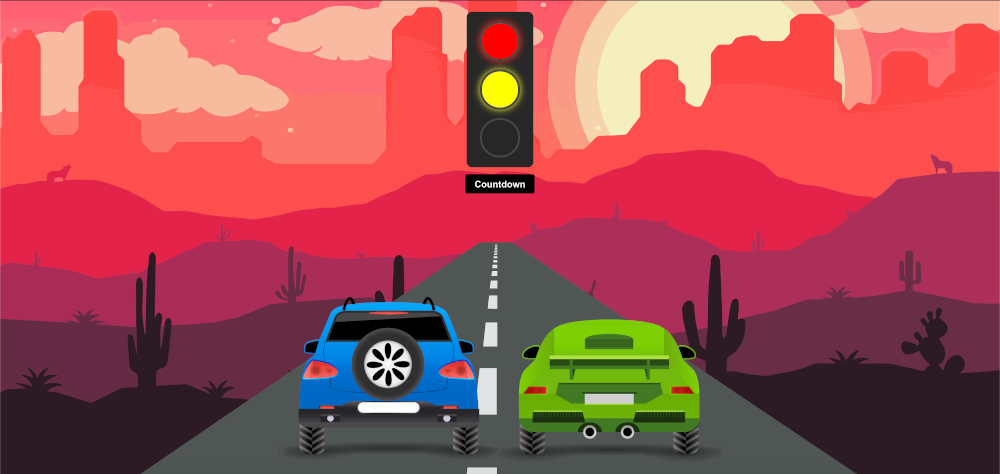

# Stoplight useEffect()



## Overview
In this lab, we'll be creating a desert drag race with the `useEffect` and `useState` React hooks to get practice using these hooks together.

## Getting Started
- `Fork` and `clone` this repository
- A starter app has been provided for you
- Open in VSCode with `code .`
- `cd` into the new directory and run `npm i` to install our dependencies

## Instructions
### Setup
In this lab, we'll only be working in 2 of the 4 components in our application, `Stoplight.jsx` and `Highway.jsx`. That being said, let's take a look at our App's component hierarchy before we move on:


Currently, we have two `useState()` variables, one in `App.js` and one in `Highway.jsx`.
- `lights` is an object with three boolean key value pairs, which we'll be using to control our `Stoplight` functionality:

    ```js
    const [lights, setLights] = useState({red: false, yellow: false, green: false})
    ```
- Notice how `lights` and `setLights` are being passed as props into our `<Highway>`and `<Stoplight>` components. It's state is lifted up into `App.js` since we'll be using it in both components.

    ```js
    <StopLight lights={lights} setLights={setLights} />
    <Highway lights={lights} />
    ```

- `racing` is initially set to a string value `'cars'` which is being used as a `className` within  `Highway.jsx`
    ```js
    const[racing, setRacing] = useState('cars')
    ```

3 things need to happen for our racing application to function:
- We'll need the button in `StopLight.jsx` to be able to set the individual key value pairs in our `lights` state within an `onClick` callback function.
- We'll need to add in some conditional rendering in `Stoplight.jsx` to reflect the changes in the `lights` state
- And lastly, we'll need to use the `lights` state in `Highway.jsx` to affect the state of racing in some way.

We've taken a good look at the architecture of our application, so let's start working in `Stoplight.jsx`!

___
### Stoplight
Since `lights` and `setLights` are being passed as props, let's destructure them from our component's arguments so they'll be available to us as `lights` and `setLights` within `Stoplight.jsx`.

```js
const StopLight = ({lights, setLights}) => {
```

We now have access to `lights` and `setLights`, so let's use them! We have a `<button>` in our component with a className of `countdown`. Currently, it isn't doing anything, so let's give it an `onClick` callback function that will do the following:

```js
onClick={() => {
  // Condition #1
  // If the state of all three lights (red, yellow, green) is true:
  // set the state of all lights (red, yellow, green) back to false

  // Condition #2
  // If only the red and yellow lights have a value of true:
  // Keep the state of red and yellow as true and set the state of the green light to true

  // Condition #3
  // If only the state of the red light is true
  // Keep the state of the red light as true and set the state of the yellow light to true

  // Condition #4
  // Otherwise, if none of the lights have a state of true
  // Keep the state of the other lights false, and set the state of only the red light to true
}}
```

Add `console.log(lights)` to the top of your `StopLight` component to check if you're properly updating state with your `onClick` function.


Remember that if you want to keep the existing state of an object and only update one of its keys, you can use the spread `...` operator. Example:

```js
setLights({...lights, red: true})
```

<details><summary>Need a hint?</summary></br>
  
  A `switch case` might be useful here.

  `if / else` might also work if you're more comfortable with that.

</details>

<br/>

After you've finished adding in the conditional state-setting functionality to the `onClick` of the the button in `StopLight.jsx`, there are a couple more things we'll need to do to update its UI to reflect the changes in state.

- First, we'll replace the content of the `<button>`, which currently says "Count" with a bit of conditional text:
    
    ```js
    <button
    className="countdown"
    onClick={() => {
      ...
    }}
    >
      {lights.red && lights.yellow && lights.green ? "Reset" : "Countdown"}
    </button>
    ```

- Our button should be switching between `Countdown` and `Reset` depending on the state of our `lights`!

Next, let's add in the actual lights!
- Inside the `<div>` with a className of `stoplight`, we'll give each of the three child `<div>`s a conditional className depending on our `lights` state. Example:
    ```js
    <div className={lights.red ? 'red' : undefined}></div>
    ```
  - If the red light is set to true, the top `<div>` will be given a className of `'red'`, otherwise it will be undefined
  - The middle `<div>` will be given a className of `'yellow'` if `lights.yellow` is true.
  - Likewise, the bottom `<div>` will be given a className of `'green'` if the state of the green light is true

When you've finished, make sure to start up your app with `npm start` and see if you have all three lights working properly. They should also be able to reset once all three are showing! Great! Now let's move onto `Highway.jsx`, since we're done with `StopLight.jsx`.

___
### Highway
Now that we're in our `Highway` component we can work on the fun part - the race!

Let's start out by destructuring `lights` from its arguments, since they are being passed as props from `App.js`.

```js
const Highway = ({lights}) => {
```

After destructuring `lights`, create a function below the `useState()` declaration in `Highway.jsx` called `toggleRacing`. We'll use this function to set the state of `racing` to either `'cars'` or `'cars race'` in the following manner:

```js
const [racing, setRacing] = useState('cars')

const toggleRacing = () => {
  racing === 'cars' ? setRacing('cars race') : setRacing('cars')
}
```

Now what if we wanted to fire this function whenever this component loads? That way we won't have to do it manually from the UI. This would be a great time to implement a `useEffect()` hook! 

Let's add one into our `Highway` component.
- Make sure that you've added `useEffect` in your imports at the top of the file, next to `useState`
    
    ```js
    import React, {useState, useEffect} from 'react'
    ```

- Once you've added it in, declare a `useEffect()` hook below our `toggleRacing` function and _invoke_ `toggleRacing`
- Remember that `useEffect()` requires an anonymous callback function:
    
    ```js
    useEffect(() => {
      // do something here
    })
    ```

Try testing out your stoplight app in the browser with `npm start`.

Oh no! An endless loop! Render burnout! Spinning our wheels is cool and all, but we're here to race, right?


Every time our `Highway` component mounts, it will fire the `toggleRacing` function for us. We've set a condition that will switch between either `'cars'` or `'cars race'` and set the state of our component. Since the component re-renders every time state is set, we'll be stuck in an endless loop forever. 

Let's fix that with some stronger conditions. 

Replace the ternary in `toggleRacing` with these lines of code:

```js
const toggleRacing = () => {
  if (racing==='cars' && lights.green) {
    setRacing('cars race')
  }
  if (racing==='cars race' && !lights.green) {
    setRacing('cars')
  }
}
```

Since we've added the `lights` state passed down from props into our conditions to track changes in only the green light, we won't be setting state every time the component loads. 

And with that we've done it! Our `useEffect()` will take care of the work of firing our `toggleRacing` function and setting the state of `racing` for us _without_ getting stuck in an endless loop! Try testing your app out in the browser.

___
## Recap
In this lab we worked with `useState()` and `useEffect()` to build our stoplight racing app. A couple things to note about `useEffect()`:
- `useEffect()` will run every time a component is mounted (rendered in the Virtual DOM)
- It's not recommended to set state within a `useEffect()` since settting state will cause a component to re-render.
- In this case, we set a few conditions inside of our `toggleRacing` function to prevent our state from being updated continuously, which would create an endless loop.
- We used state passed from a parent component, `lights` in this case, to control the state setting of our `useEffect()`.

## Resources
- [React useEffect Docs](https://reactjs.org/docs/hooks-effect.html)
