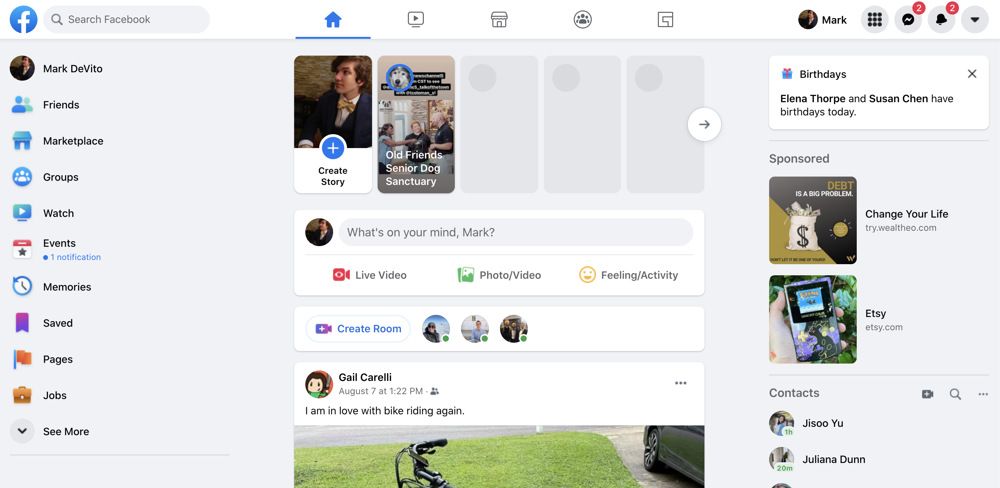
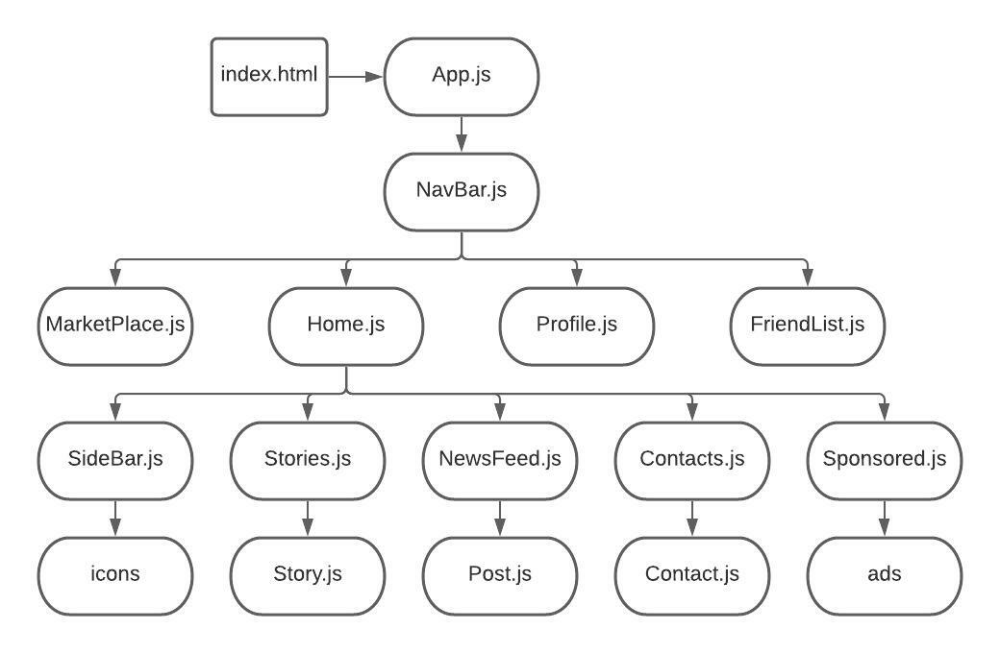

# Component Hierarchy Diagrams

## Overview
In this lesson, we'll learn about component hierarchy diagrams and how to use them when building a complicated project. We'll also review component hierarchy diagrams of popular websites such as facebook.com.

## What is a Component Hierarchy Diagram?
A component hierarchy diagram is a useful tool in planning a React application with various interconnected components. This diagram can help you map out which components you need to build, and where you need to put them in your code.

_Disclaimer: The abbreviation CHD is not a software engineering accronym. If you say "I have a CHD," in an interview, you will get strange looks._

## Why Use a Component Hierarchy Diagram?
React Review:

One of the benefits of React is the Virtual DOM, which allows us to target specific portions of a page for smaller updates rather than rerendering the entire page with every small change. In order to make the most of this, it is best practice to break down your application into smaller, reusable components that pass props to each other. 

As your applications become more complicated, the list of components gets longer, and it gets increasingly difficult to keep track of all of the pieces in your brain. A component hierarchy diagram (aka component level diagram) can be used to visualize where all the pieces fit.

## Example

Let's look at Facebook for an example. 

The navigation bar on the top is always there, with component pages that render under it. In the photo above, we can see the Home page. 

On this page, we see many various components: a side bar, a contact list, a newsfeed, and more.

Each of these components also has smaller components attatch to them. For example, the "Contacts" component render several individual "Contact" components. The "NewsFeed" component renders many "Post" components.

This component hierarchy diagram can help us map out how all of these pieces fit together before we start writing a lengthy React application with many component files.

## Resources

There are many applications out there for creating diagrams like:

[LucidChart](https://www.lucidchart.com/pages/)

[Draw.io](https://app.diagrams.net/)
