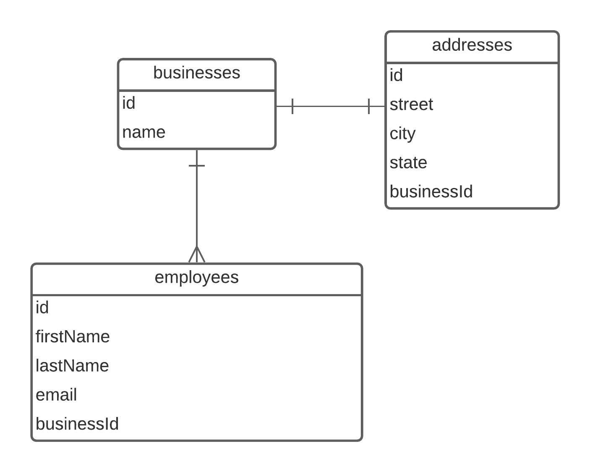

# Sequelize Migrations and Associations

## Getting Started

- Fork and Clone
- `npm install`
- `sequelize db:create`
- `sequelize db:migrate`

## Instructions

We've provided you with 3 models:

- Business
- Employee
- Address

### Defining Associations

You must associate the models according to this ERD:

You'll need to create migrations to add the foreign key to the associated models.

**Note**: You'll want to update your models as well.

Once you've created and executed your migrations, run `sequelize db:seed:all` to check your work. If the seeds fail, your models are not associated correctly or a migration was not executed/defined correctly.

### Querying

Once you've successfully seeded your database, work in `queries.js`. Follow the provided prompts in each function.

Run `npm run test` to check your work as you go.

Make sure to read the prompts **carefully**.

## Submission

Pull requests are due next day following the [PR Submission Guidelines](https://github.com/SEI-R-2-22/template_pull_request)
