# SQL


## Overview

In this lesson we'll learn how to build and interact with a `PostgreSQL` database. We'll utilize the `postgres shell` or `psql` to interact and execute commands on a database.

### Objectives

- Interact with the PSQL command line
- Create and DELETE a database
- Create and DELETE a table
- Insert, retrieve, update, and delete a row or rows into a database table

## What are Databases?

A database is a place where information gets stored `persistently` on a computer somewhere. Much like we've been creating and storing data, here and there, a database represents a collection of individual pieces of data stored in a highly structured and searchable way; they are able to represent a model of reality.

Inside a database, we do basic actions like create, read, update, and destroy data – these operataions are commonly refered to by the acronym CRUD and are essential to modern web development.

In modern web development, there are different categories of databases primarily SQL and NoSQL. We're focusing on SQL becuase it's a more general and robust solution.

SQL stands for Structured Query Language, and it's a language used to manage and get information from what are considered "relational" databases.

Wikipedia on relational databses:

> This model organizes data into one or more tables (or "relations") of columns and rows, with a unique key identifying each row. Rows are also called records or tuples.[3] Columns are also called attributes. Generally, each table/relation represents one "entity type" (such as customer or product). The rows represent instances of that type of entity (such as "Lee" or "chair") and the columns representing values attributed to that instance (such as address or price). -[wikipedia](https://en.wikipedia.org/wiki/Relational_database)


## Ok, so we know about Databases, but what is SQL?

Let's review: at it's simplest, a relational database is a mechanism to store and retrieve data in a tabular form. Spreadsheets are a good analogy! But how do we interact with our database: inserting data, updating data, retrieving data, and deleting data? That's where SQL comes in!

#### What is SQL?

SQL stands for Structured Query Language, and it is a language universally used and adapted to interact with relational databases. When you use a SQL client and connect to a relational database that contains tables with data, the scope of what you can do with SQL commands includes:

- Inserting data
- Querying or retrieving data
- Updating or deleting data
- Creating new tables and entire databases
- Control permissions of who can have access to our data

Note that all these actions depend on what the database administrator sets for user permissions: a lot of times, as an analyst, for example, you'll only have access to retrieving company data; but as a developer, you could have access to all these commands and be in charge of setting the database permissions for your web or mobile application.

#### Why is SQL important?

Well, a database is just a repository to store the data and you need to use systems that dictate how the data will be stored and as a client to interact with the data. We call these systems "Database Management Systems", they come in _many_ forms:

- MySQL
- SQLite
- PostgreSQL (what we'll be using!)

...and all of these management systems use SQL (or some adaptation of it) as a language to manage data in the system.

## Connect, Create a Database

Let's make a database! First, make sure you have PostgreSQL running. Once you do, open your terminal and type:

```bash
$ psql
```

You should see something like:

```bash
your_user_name=#
```

To exit the psql CLI you can:

```bash
your_user_name=# \q
```

> Or you can <kbd>ctrl</kbd>+<kbd>d</kbd> out of it.

Great! You've entered the PostgreSQL command line: now, you can execute PSQL commands, or PostgreSQL's version of SQL.

Let's use these commands, but before we can, we must create a database. Let's call it sei_r:

```psql
your_user_name=# CREATE DATABASE sei_r;
CREATE DATABASE
```

The semicolon is important! Be sure to always end your SQL queries and commands with semicolons.

To delete the Database:

```bash
your_user_name=# DROP DATABASE sei_r;
```

Let's list the Databases we have in psql

```psql
your_user_name=# \l
```

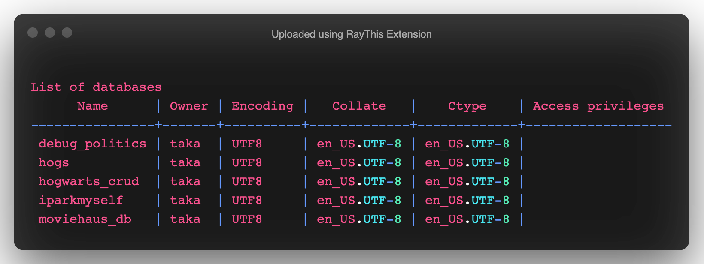

Now let's _use_ that database we just created:

```psql
your_user_name=# \c sei_r
You are now connected to database "sei_r" as user "your_user_name".
sei_r=#
```

## Create a table

Now that we have a database, let's create a table (think of this like, "hey now that we have a workbook/worksheet, let's block off these cells with a border and labels to show it's a unique set of values"):

#### SQL style guide (see http://www.sqlstyle.guide)

1. Fields should _always_ be `lowercase` and `under_scored`
2. SQL _keywords_ SHOULD ALWAYS BE IN CAPS
3. Always check your company's style guide, or follow the convention; never create your own style.

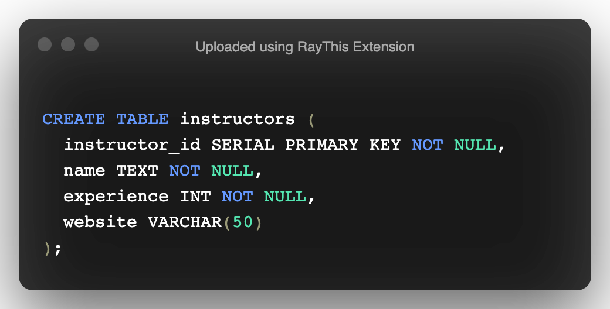

When we paste this into psql:

```psql
sei_r=# CREATE TABLE instructors (
sei_r(#  instructor_id  SERIAL PRIMARY KEY   NOT NULL,
sei_r(#  name           TEXT          NOT NULL,
sei_r(#  experience     INT           NOT NULL,
sei_r(#  website        VARCHAR(50)
sei_r(#  );
CREATE TABLE
```

Notice the different parts of these commands:

```psql
sei_r=# CREATE TABLE instructors (
```

This starts our table creation, it tells PostgreSQL to create a table named "instructors"..

```psql
sei_r(#  instructor_id        SERIAL   PRIMARY KEY   NOT NULL,
sei_r(#  name      TEXT                NOT NULL,
```

...then, each line after denotes a new column we're going to create for this table, what the column will be called, the data type, whether it's a primary key, and whether the database - when data is added - can allow data without missing values. In this case, we're not allowing `name`, `instructor_id` to be blank; but we're ok with `website` being blank.

> Read up on PSQL datatypes [here](https://www.postgresql.org/docs/10/static/datatype.html)

## Create a student table and insert data

Now that we're keeping track of our instructors, let's create a table for students that collects information about:

- an id that cannot be left blank
- the students name that cannot be left blank
- their age
- and their address that cannot be left blank.

Remembering the commands we just went over, students, try to guide the instructors through this!

Here's what that query should have looked like:

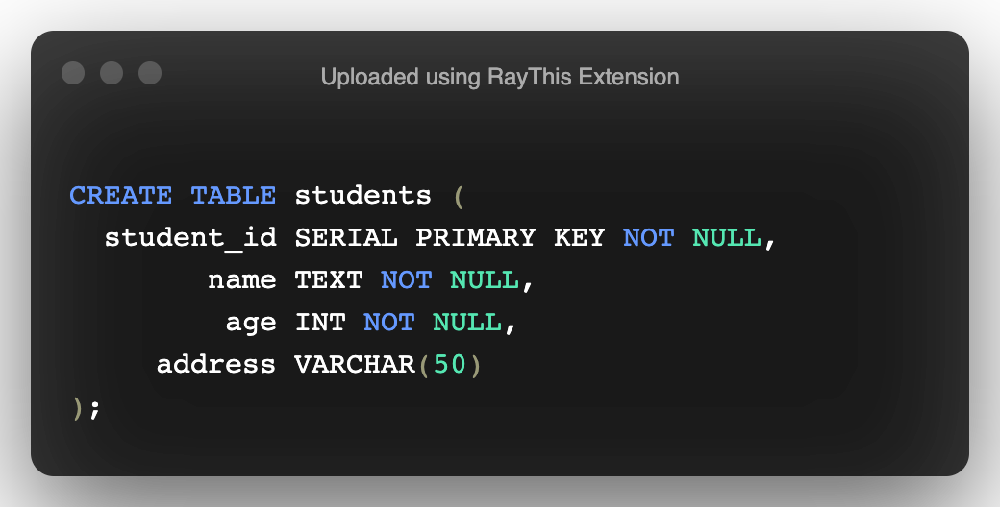

In psql that will look like:

```psql
sei_r=# CREATE TABLE students (
sei_r(#  student_id  SERIAL   PRIMARY KEY   NOT NULL,
sei_r(#  name        TEXT                NOT NULL,
sei_r(#  age         INT                 NOT NULL,
sei_r(#  address     VARCHAR(50)
sei_r(#  );
CREATE TABLE
```

Great job! Now let's finally _insert_ some data into that table - remember what cannot be left blank!

We'll insert five students, Jack, Jill, John, Jackie, and Slagathorn. The syntax is as follows:

```psql
INSERT INTO table_name VALUES (value1, value2, value3,...);
```

Let's do it for Jack, together:

```sql
INSERT INTO students VALUES (DEFAULT, 'Jack Sparrow', 28, '50 Main St, New York, NY');
```

In psql that will look like:

```psql
sei_r=# INSERT INTO students VALUES (DEFAULT, 'Jack Sparrow', 28, '50 Main St, New York, NY');
INSERT 0 1
```

## Insert Data

Now, you try it for the other students, and pay attention to the order of Jack's parameters and the single quotes - they both matter.

- Jill's full name is Jilly Cakes; she's 30 years old, and lives at 123 Webdev Dr. Boston, MA
- Johns's full name is Johnny Bananas; he's 25 years old, and lives at 555 Five St, Fivetowns, NY
- Jackie's full name is Jackie Lackie; she's 101 years old, and lives at 2 OldForThis Ct, Fivetowns, NY
- Slagathorn's full name is Slaggy McRaggy; he's 28 and prefers not to list his address

You should come up with:

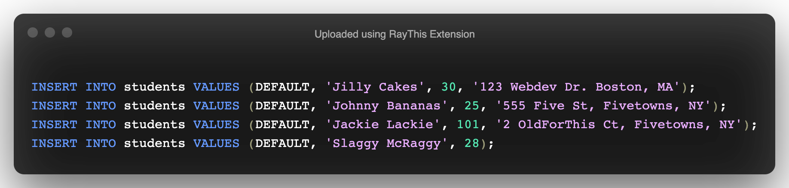

In psql this should look like:

```psql
sei_r=# INSERT INTO students VALUES (DEFAULT, 'Jilly Cakes', 30, '123 Webdev Dr. Boston, MA');
INSERT 0 1
sei_r=# INSERT INTO students VALUES (DEFAULT, 'Johnny Bananas', 25, '555 Five St, Fivetowns, NY');
INSERT 0 1
sei_r=# INSERT INTO students VALUES (DEFAULT, 'Jackie Lackie', 101, '2 OldForThis Ct, Fivetowns, NY');
INSERT 0 1
sei_r=# INSERT INTO students VALUES (DEFAULT, 'Slaggy McRaggy', 28);
INSERT 0 1
```

## What's in our database?

So now that we have this data saved, we're going to need to access it at some point, right? We're going to want to _select_ particular data points in our dataset provided certain conditions. The PostgreSQL SELECT statement is used to fetch the data from a database table which returns data in the form of result table. These result tables are called result-sets. The syntax is just what you would have guessed:

```psql
SELECT column1, column2, column3 FROM table_name;
```

We can pass in what columns we want to look - like above - at or even get all our table records:

```psql
SELECT * FROM table_name;
```

The above command will get all of the records back:

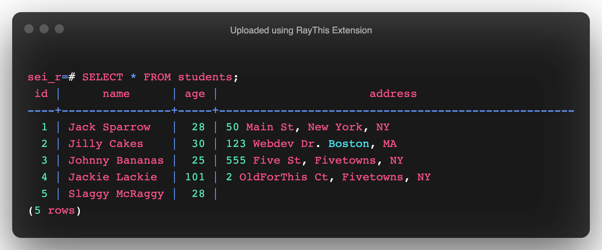

We can get just the name and ages of our students:

```psql
sei_r=# SELECT name, age FROM students;
```

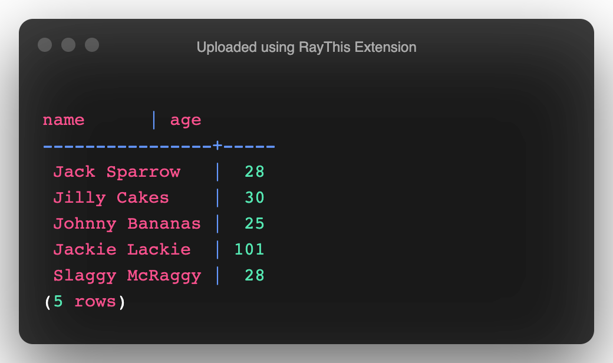

#### Getting more specific

Just like JavaScript, all of our comparison and boolean operators can do work for us to select more specific data.

- I want the names of all the students who aren't dinosaurs - done:

```psql
sei_r=# SELECT name FROM students WHERE age < 100;
```

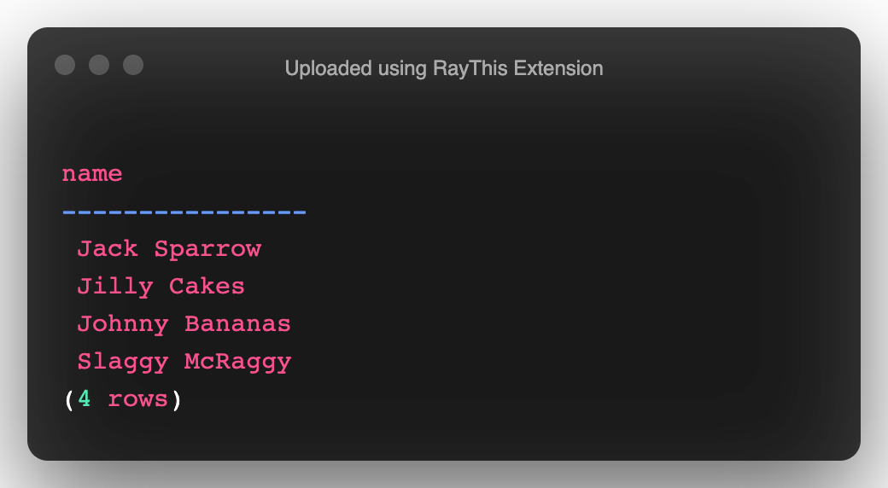

- How about the names of students ordered by age? Done:

```psql
sei_r=# SELECT name, age FROM students ORDER BY age;
```

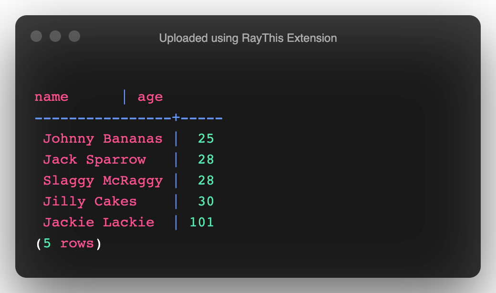

- How about reversed?:

```psql
sei_r=# SELECT name, age FROM students ORDER BY age DESC;
```

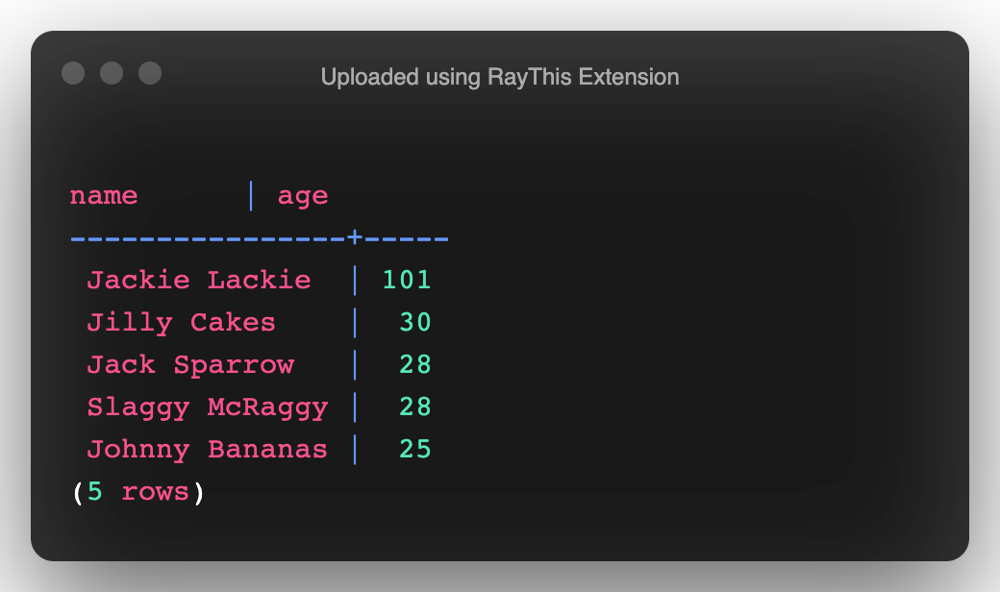

- How about those who live in Fivetowns? We can find strings within strings too!

```psql
sei_r=# SELECT * FROM students WHERE address LIKE '%Fivetowns%';
```

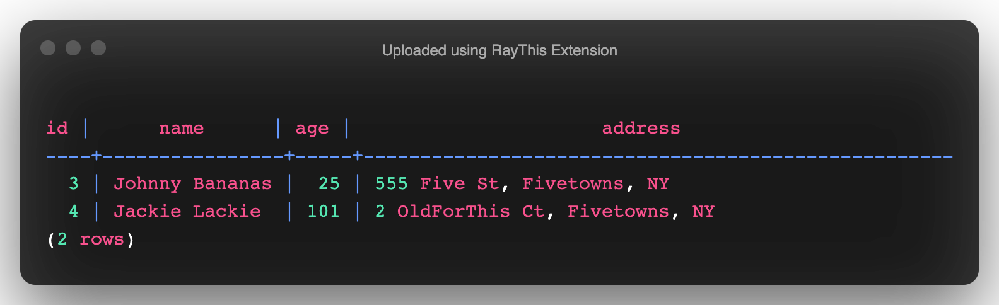

## Updates to our database

Ok, there are some mistakes we've made to our database, but that's cool, cause we can totally update it or delete information we don't like. Let's start by adding one more student:

```psql
sei_r=# INSERT INTO students VALUES (DEFAULT, 'Miss Take', 500, 'asdfasdfasdf');
INSERT 0 1
```

But oh no, we messed them up - Miss Take doesn't live at asdfasdfasdf, she lives at 100 Main St., New York, NY. Let's fix it:

```psql
sei_r=# UPDATE students SET address = '100 Main St., New York, NY' WHERE address = 'asdfasdfasdf';
UPDATE 1

sei_r=# SELECT * FROM students;
```

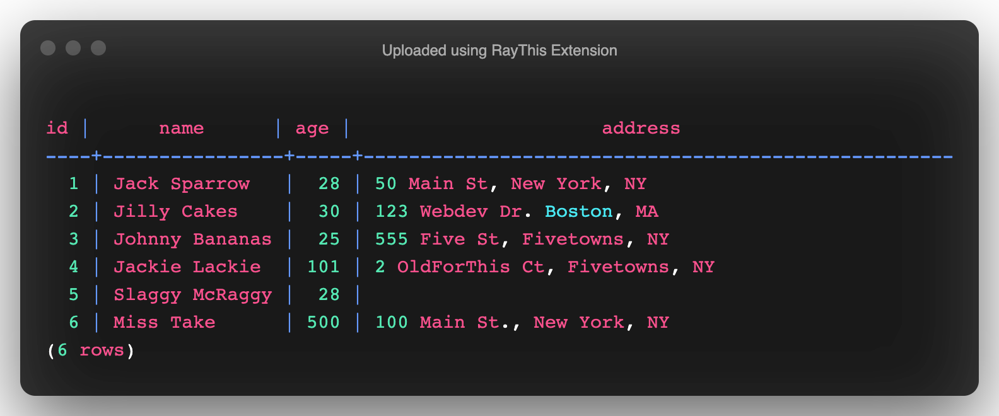

But wait, actually, she just cancelled - no big!

```psql
sei_r=# DELETE FROM students WHERE name = 'Miss Take';
DELETE 1

sei_r=# SELECT * FROM students;
```

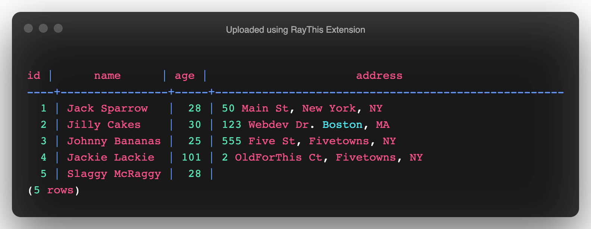

## Practice

Using the same database from above, get through as many of these SQL challenges as you can.

- Insert five more students:

  - Nancy Gong is 40 and lives at 200 Horton Ave., Lynbrook, NY
  - Laura Rossi is 70 and listed her address as "Unlisted"
  - David Daniele is 28 and lives at 300 Dannington Ln., Washington, DC.
  - Greg Fitzgerald is 25 and did not list an address
  - Randi Fitz is 28 and lives in Oceanside, NY

- Randi wants her address to be corrected to 25 Broadway, New York, NY
- Get a list of student names and addresses who are older than 30 and order them by their address alphabetically
- Get a list of students whose first name begins with the letter "J"
- Get a list of student names who live in NY or MA

## Recap

We will learn later on to relate our DB usage into backend services.
SQL gives us a fast and reliable way to access data in a structured and logical way.

# Resources

1. [www.sqlstyle.guide](http://www.sqlstyle.guide)
2. [PostgreSQL tutorial](http://www.tutorialspoint.com/postgresql/)
3. [PSQL datatypes](https://www.postgresql.org/docs/10/static/datatype.html)

### Common Postgresql Commands

Here are a list of some common Postgresql commands that you might need:

- `\c` - connect to database
- `\l` - list all DBs
- `\d` - list details
- `\d+` - details of this table
- `\q` - exit psql
- `\h` - help
