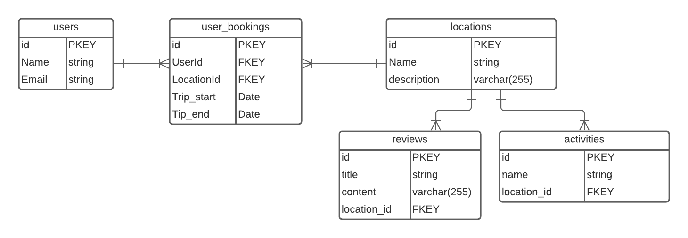

# Database Design

## Objectives

- Design a relational database
- Associate models/tables correctly

## Overview

Database design is one of the most important steps in building a robust backend service. How you store and associate data plays a big part in how well your application scales. With relational databases it's better to have more tables than not enough. Relational databases operate on a column/row approach, sort of like a spreadsheet. We associate different records utilizing a `foreign key`, which can be any kind of unique identifier; typically an `id`.

## Relationship Design

Let's say we want to create a database to store information about a travel app. The functionality/tables we would have is as follows:

- User/Booking
- Locations
- Activities
- Reviews

Our associations could possibly be like this:

- Locations has many activities / Activities belongs to Location
- Locations has many reviews / Reviews belong to Locations
- User has many Locations through `User_Bookings`

Here's an `ERD` to demonstrate this:

If you need help remembering the symbols used in an erd, here is a cheatsheet: **[ERD cheatsheet](https://drive.google.com/file/d/0B_spkK3eZiHmZTZhczVTaVZxUFU/view)**

## Analyzing The ERD

Looking at this diagram, here are few questions to ask:

- Are there any relationships that don't make sense?
- What are some optimizations we can do to this erd?
- What additional functionality could you add to the erd?

### A Few Side Notes

- Don't be afraid of creating more tables
- Add as many columns as you think is necessary
- Through/join tables are your friend, take advantage of them!

## You Do

 Build out an ERD for an ecommerce website, it needs to have the following features for MVP:

- At least one 1-to-1 and at least one 1-to-many relationship
- At least one parent table with two children
- At least one table that both has its own parent and its own child table

- Product
- Reviews
- Product Category
- User
- Cart

Feel free to add more functionality! Be ready to showcase and explain your design decisions!

## Recap

In this lesson, we discussed and implemented an erd to build relationships between different tables in a database.
By understanding how relationships work in a database, we're able to build a visual aid to help us have a plan of action while building a database for our application.

## Resources

- [Database Relationships By IBM](https://www.ibm.com/support/knowledgecenter/SSANHD_7.6.0/com.ibm.mbs.doc/configur/c_db_relationships.html)
- [How To Design A Great ERD](https://creately.com/blog/diagrams/er-diagrams-tutorial/)
