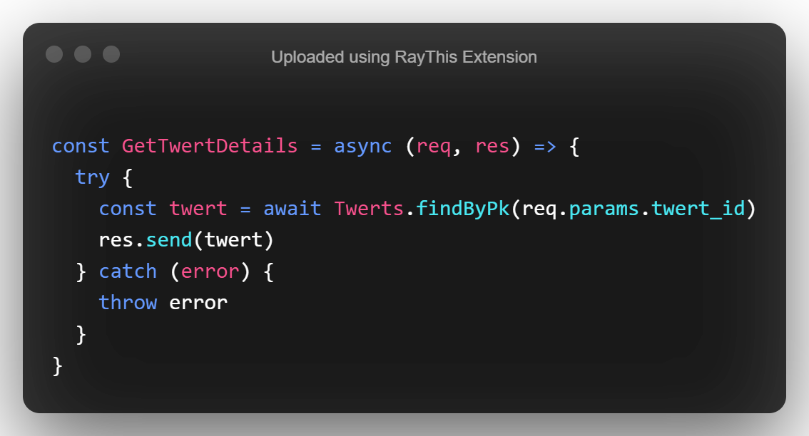
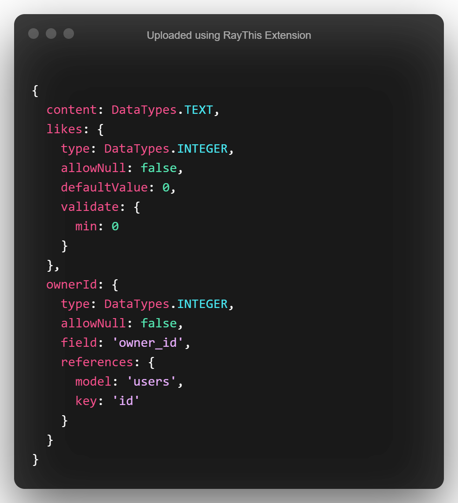
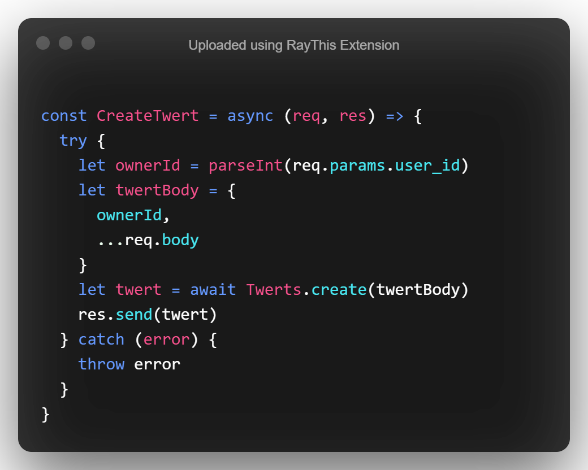
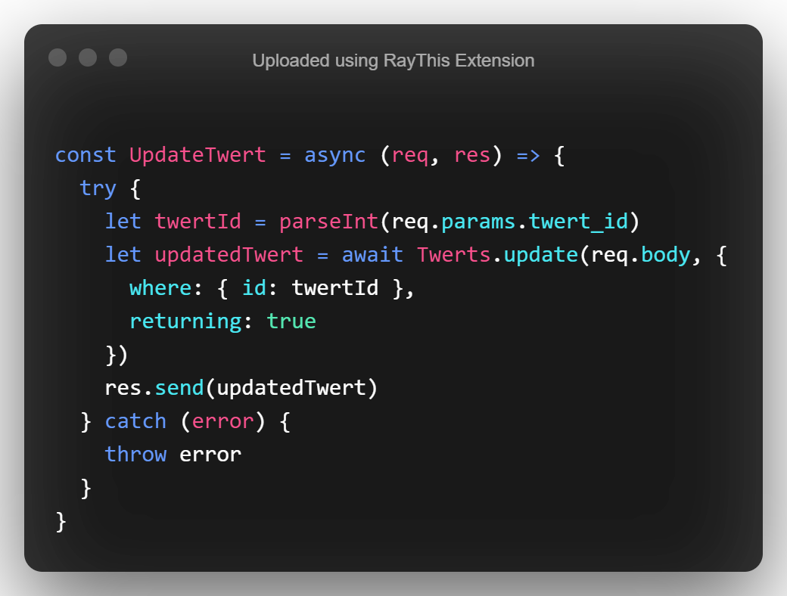
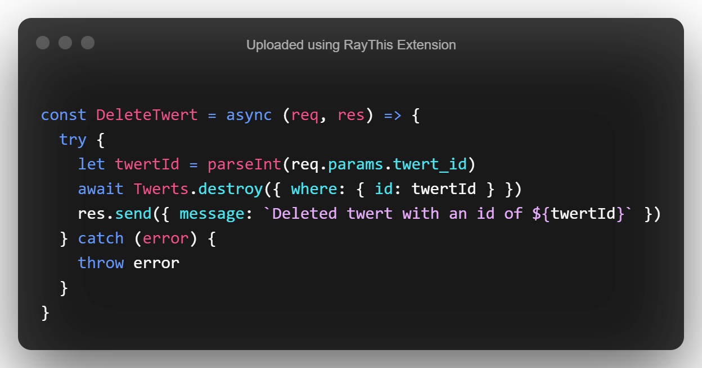

# Express & Sequelize


## Overview

In this lesson we'll learn how to integrate our newly learned Sequelize skills with Express to build a RESTful API. We'll perform full `CRUD` functionality on our `Twert` model.

_"Yes, I know totally not a tweet or twitter..."_

## Getting Started

- `Fork` and `Clone`
- `npm install`
- `sequelize db:create`
- `sequelize db:migrate`
- `sequelize db:seed:all`
- `npm run dev`

## Testing the Server

Make a `GET` request to `http:localhost:3001/` using your REST client (Insomnia, Or Postman), and confirm that your server is working. You should see the following message:

```json
{
  "message": "Server Works"
}
```

## Testing Pre-Built Routes

Some routes have been set up for you already. Test the following routes and ensure that you are receiving a JSON response:

- `GET` : `http://localhost:3001/api/feed/trending`
- `GET` : `http://localhost:3001/api/feed/recents`
- `GET` : `http://localhost:3001/api/users`
- `GET` : `http://localhost:3001/api/users/:user_id`, **Get a user id from the above response!**

We'll be building basic **CRUD** functionality for our twerts. Endpoints have already been set up for you in the `TwertRouter.js` file.

### Read

Let's start with the first one:

```js
Router.get('/view/:twert_id')
```

Open the `TwertController.js` file and find the function called `GetTwertDetails`. I should be able to find a twert by it's primary key. Query for a twert by id:



Let's link this function to our `TwertRouter`:

```js
Router.get('/view/:twert_id', controller.GetTwertDetails)
```

Test this endpoint by finding a random twert id in your database, you can also use any number between 1-400. Make a `GET` request to the following endpoint:

- `GET` : `http://localhost:3001/api/feed/view/<Some Twert Id>`

You should a valid JSON response, here's an example:

```json
{
  "updatedAt": "2020-12-01T03:54:06.668Z",
  "ownerId": 89,
  "owner_id": 89,
  "likes": 23589,
  "id": 3,
  "createdAt": "2020-12-01T03:54:06.668Z",
  "content": "Quo praesentium ex. Dolor molestiae velit ut tempora error voluptate voluptatem aut. Ea repellendus neque eveniet aut velit ea. Voluptates ad aperiam in. Voluptatem quo est aut assumenda sit."
}
```

### Create

Let's create a twert. Our `Twerts` model has the following fields:



The `ownerId` being a foreign key is **not** something we provide through the request body, typically you'll see this in a request query or request params. For our example we'll use the request params.

In the `TwertRouter.js` file find the endpoint for post:

```js
Router.post('/:user_id')
```

In your `TwertController.js` file, find the function called `CreateTwert`.

Let's use the `create` method attached to our model to create a new twert:



Let's break this down:

- We're getting the user id from the request params, by default the params are a string so we parse that value to an integer.
- We create a new object containing everything from the request body and add in the `ownerId`, remember the object keys provided must match what's in our model.
- Utilizing the `create` method for our model, we create a new twert and send it back in the response.

Navigate back to your `TwertRouter.js` and link that method to it's appropriate endpoint:

```js
Router.post('/:user_id', controller.CreateTwert)
```

Test the endpoint in your REST client:

- `POST` : `http://localhost:3001/api/feed/<Some User Id>` , again pick a random user id between 1-100.

Here's an example of the request body as JSON:

```json
{
  "content": "A non controversial twert...."
}
```

You should see a new twert come back as a reponse:

```json
{
  "updatedAt": "2020-12-01T07:32:50.688Z",
  "ownerId": 3,
  "likes": 0,
  "id": 401,
  "createdAt": "2020-12-01T07:32:50.688Z",
  "content": "A non controversial twert...."
}
```

You'll notice we never sent a `likes` field in the original `POST` request, that field is set be defaulted to `0` on creation. It would be nice to post a new twert with a billion likes I suppose...

### Update

Not really feeling that last twert? No problem, we can fix that.

Find the `put` route in your `TwertRouter.js`:

```js
Router.put('/:twert_id')
```

You'll see it accepts a `twert_id` as a parameter. That's the identifier we'll use to perform our update operation.

Find the `UpdateTwert` function in the `TwertController.js`. We'll use the `update` method from sequelize to perform our operation:



Breakdown:

- Again parsing the param to an integer
- Providing the request body to the update
- Finding the record where the id is a match
- Using the `returning:true` option to return the count of the records updated along with the updated records.

Link this method to the `PUT` route:

```js
Router.put('/:twert_id', controller.UpdateTwert)
```

Test this in your REST client by sending a `PUT` request:

- `PUT` : `http://localhost:3001/api/feed/<Use the id from the recently created twert>`

Here's an example request body:

```json
{
  "content": "A little less controversial twert...."
}
```

Here's an example response:

```json
[
  1,
  [
    {
      "updatedAt": "2020-12-01T07:44:52.579Z",
      "owner_id": 3,
      "likes": 0,
      "id": 401,
      "createdAt": "2020-12-01T07:32:50.688Z",
      "content": "A little less controversial twert...."
    }
  ]
]
```

### Delete

Time to delete some twerts. Find the `delete` endpoint in `TwertRouter.js`:

```js
Router.delete('/:twert_id')
```

Find the `DeleteTwert` function.

Let's `destroy` some bad twerts:



Link this function to the `delete` endpoint:

```js
Router.delete('/:twert_id', controller.DeleteTwert)
```

Test this in your REST client by sending a `delete` request:

- `DELETE` : `http://localhost:3001/api/feed/<Some Twert Id>`

You should see the following message:

```json
{
  "message": "Deleted twert with an id of 401"
}
```

You can confirm the deletion by making a GET request to the `/view/` endpoint with the id you just used to make the deletion.

## Additional Routes

You've been tasked with building out CRUD functionality for comments. Work in the `CommentController` and `CommentRouter` files. Test your endpoints as you move along. You'll use the `/comments` endpoint to start your requests, example:

> `http://localhost:3001/api/comments`

## Bonus

- Add a followers feature using a many-many-self relationship with the ability to follow other users

- Build an endpoint that allows liking a twert or comment, you should only be allowed to increment the likes by 1 each time.

- If you created the followers feature, build in functionality to view the amount of followers and following for a user when visiting their profile, you can use the `GetUserProfile` function in the user controller for this. An example of this is in the `TwertController`.

## Recap

In this lab, we learned how to integrate our Sequelize models with Express to build a full CRUD RESTful API.

## Resources

- [Sequelize Docs](https://sequelize.org/master/)
- [Express Docs](https://expressjs.com/)
