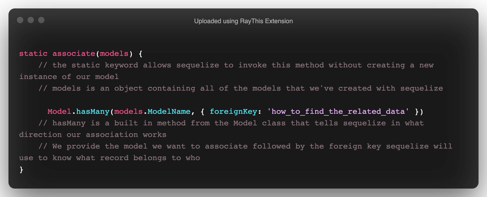
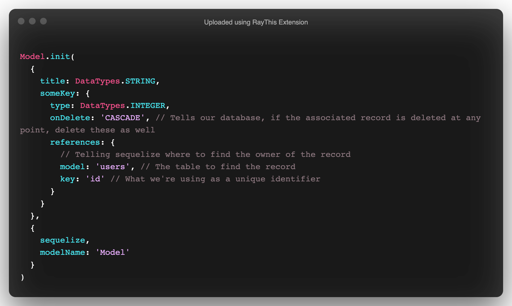

# Sequelize Associations


## Overview

In this lesson, we'll be covering how to build associations bewteen different models/tables. We'll set up foreign keys and execute queries to `include` the related data. Associations are one of the most important topics we'll cover when it comes to relational databases as they are the principles that make relational databases as popular as they are.

## Getting started

- Fork and Clone
- `npm install`
- `mkdir migrations` for later...
- `sequelize db:create`

##

> Take five minutes and read the Sequelize docs on associations:
>
> - https://sequelize.org/master/manual/assocs.html

## What Are Associations

Associations are the relationships that we define between different data entries accross different tables. For example:

- A user can `have many` pets
- Pets `belong to` one user

Relational databases rely on associations in order to `join` data that we need in a an organized manner. It also helps reduce database load. Databases can become overwhelmed when being queried repeatedly in a short amount of time. By `joining` data, we can load all of the data we need with one query.

## Defining Models

### Defining Our User

Let's start with building a `User` model:

```sh
sequelize model:generate --name User --attributes firstName:string,lastName:string,password:string,email:string
```

The above command will generate the following model:

```js
'use strict'
const { Model } = require('sequelize')
module.exports = (sequelize, DataTypes) => {
  class User extends Model {
    /**
     * Helper method for defining associations.
     * This method is not a part of Sequelize lifecycle.
     * The `models/index` file will call this method automatically.
     */
    static associate(models) {
      // define association here
    }
  }
  User.init(
    {
      firstName: DataTypes.STRING,
      lastName: DataTypes.STRING,
      password: DataTypes.STRING,
      email: DataTypes.STRING
    },
    {
      sequelize,
      modelName: 'User'
    }
  )
  return User
}
```

Let's update the `User` model to have a lowercased `tableName`

```js
...

    {
      sequelize,
      modelName: 'User',
      tableName: 'users'
    }

...
```

Next we'll need to update our migration to reflect our desired `tableName`:

```js
'use strict'
module.exports = {
  up: async (queryInterface, Sequelize) => {
    await queryInterface.createTable('users', {
      id: {
        allowNull: false,
        autoIncrement: true,
        primaryKey: true,
        type: Sequelize.INTEGER
      },
      firstName: {
        type: Sequelize.STRING
      },
      lastName: {
        type: Sequelize.STRING
      },
      password: {
        type: Sequelize.STRING
      },
      email: {
        type: Sequelize.STRING
      },
      createdAt: {
        allowNull: false,
        type: Sequelize.DATE
      },
      updatedAt: {
        allowNull: false,
        type: Sequelize.DATE
      }
    })
  },
  down: async (queryInterface, Sequelize) => {
    await queryInterface.dropTable('users')
  }
}
```

You can now execute the migration:

```sh
sequelize db:migrate
```

### Defining A Task Model

Let's start by creating a task model:

```sh
sequelize model:generate --name Task --attributes title:string,userId:integer
```

The above command will generate the following model:

```js
'use strict'
const { Model } = require('sequelize')
module.exports = (sequelize, DataTypes) => {
  class Task extends Model {
    /**
     * Helper method for defining associations.
     * This method is not a part of Sequelize lifecycle.
     * The `models/index` file will call this method automatically.
     */
    static associate(models) {
      // define association here
    }
  }
  Task.init(
    {
      title: DataTypes.STRING,
      userId: DataTypes.INTEGER
    },
    {
      sequelize,
      modelName: 'Task'
    }
  )
  return Task
}
```

Let's update the table name for our `Task`:

```js
...

    {
      sequelize,
      modelName: 'Task',
      tableName: 'tasks'
    }

...
```

## Associating Models

We'll now associate the `User` and `Task` model. The relationship we want to define is a `hasMany`/`belongsTo`:

- User `hasMany` Task
- Task `belongsTo` User

Now, you may be thinking that this is a complicated process... Believe it or not, it isn't! `Sequelize` models actually have built in methods that make it easy to associate our created models!

### Defining `hasMany`

In your `User` model, we'll attach a method that will tell `Sequelize` in what direction our association flows. Find the `static associate(models)` method in the `User` model.

We'll now define our `hasMany` relationship:

```js
class User extends Model {
  /**
   * Helper method for defining associations.
   * This method is not a part of Sequelize lifecycle.
   * The `models/index` file will call this method automatically.
   */
  static associate(models) {
    // define association here
    User.hasMany(models.Task, { foreignKey: 'userId' })
  }
}
```

Here's a quick breakdown on how this works:



### Defining `belongsTo`

Now we'll associate our `Task` to our user.

Let's add a `belongsTo` method to the `Task` model:

```js
class Task extends Model {
  /**
   * Helper method for defining associations.
   * This method is not a part of Sequelize lifecycle.
   * The `models/index` file will call this method automatically.
   */
  static associate(models) {
    // define association here
    Task.belongsTo(models.User, { foreignKey: 'userId' })
  }
}
```

The `belongsTo` method works the same way as the `hasMany` method except that we are telling Sequelize that the `Task` belongs to a `User`.

Next we'll need to update the `userId` field to declare it as a foreign key:

```js
Task.init(
  {
    title: DataTypes.STRING,
    userId: {
      type: DataTypes.INTEGER,
      onDelete: 'CASCADE',
      references: {
        model: 'users',
        key: 'id'
      }
    }
  },
  {
    sequelize,
    modelName: 'Task',
    tableName: 'tasks'
  }
)
```

Here's a quick breakdown on what we did to the `userId` field:



Now we need to reflect this change in the `Task` migration:

```js
'use strict'
module.exports = {
  up: async (queryInterface, Sequelize) => {
    await queryInterface.createTable('tasks', {
      id: {
        allowNull: false,
        autoIncrement: true,
        primaryKey: true,
        type: Sequelize.INTEGER
      },
      title: {
        type: Sequelize.STRING
      },
      userId: {
        type: Sequelize.INTEGER,
        onDelete: 'CASCADE',
        references: {
          model: 'users',
          key: 'id'
        }
      },
      createdAt: {
        allowNull: false,
        type: Sequelize.DATE
      },
      updatedAt: {
        allowNull: false,
        type: Sequelize.DATE
      }
    })
  },
  down: async (queryInterface, Sequelize) => {
    await queryInterface.dropTable('tasks')
  }
}
```

**Note: Make sure to update the table name for `Task`!**

## Querying Associations

Now that we've defined our associations, we're ready to finish migrating our database. Run the following command to execute the `Task` migration:

```sh
sequelize db:migrate
```

Next we'll create a seed file to execute some queries:

```sh
sequelize seed:generate --name task
```

Replace the contents of the seed file with the following:

```js
module.exports = {
  up: (queryInterface, Sequelize) => {
    return queryInterface.bulkInsert(
      'tasks',
      [
        {
          title: 'Build an App.',
          userId: 1,
          createdAt: new Date(),
          updatedAt: new Date()
        }
      ],
      {}
    )
  },

  down: (queryInterface, Sequelize) => {
    return queryInterface.bulkDelete('tasks', null, {})
  }
}
```

We can now run the seed files:

```sh
sequelize-cli db:seed:all
```

Let's see if our associations actually work. We'll run a join query on our `User` table:

```sh
psql sequelize_associations_development
SELECT * FROM users JOIN tasks ON tasks."userId" = users.id;
```

## Querying

Utilizing the [Sequelize Docs](https://sequelize.org/master/manual/assocs.html#lazy-loading-example), write two queries that match their provided SQL statements. The functions have been provided for you in `query.js`
To run your file, execute:

```sh
node query.js
```

## Recap

In this lesson, we learned how to define and query associations. Associations are an important concept in the relational database world and are a core fundamental to what makes these databases so powerful.

## Resources

- [Sequelize Associations](https://sequelize.org/master/manual/assocs.html)
