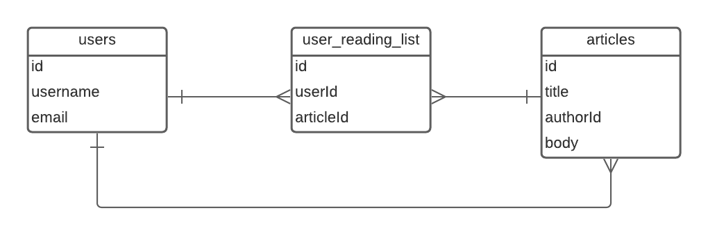
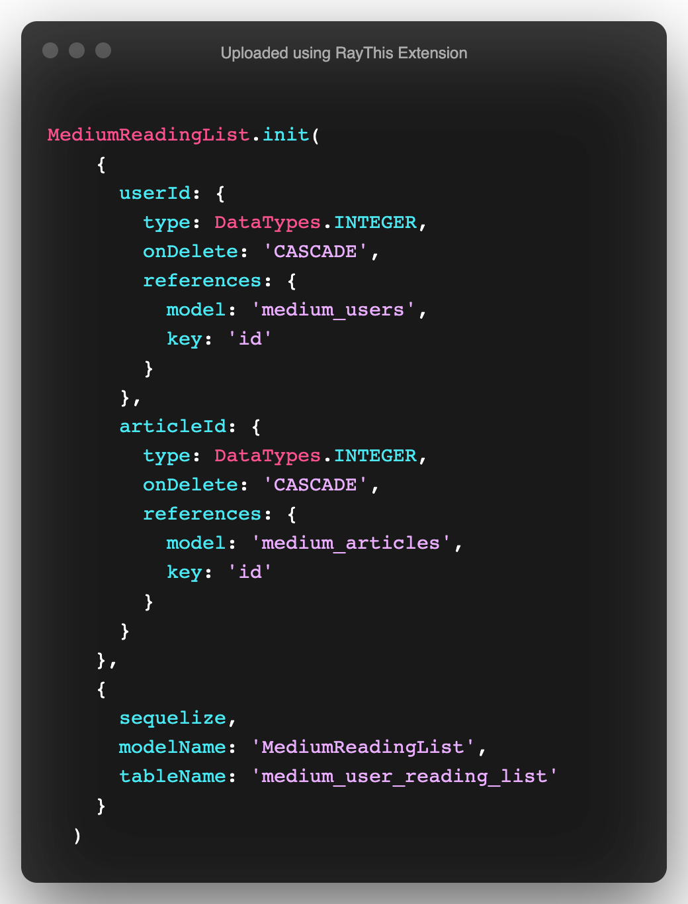
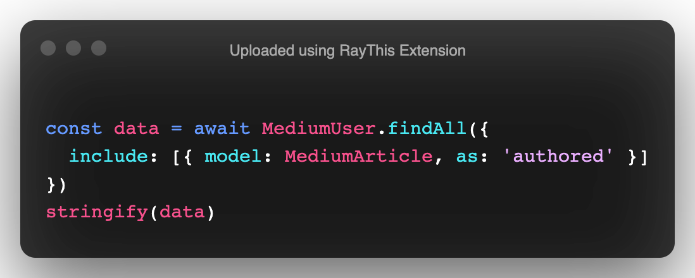
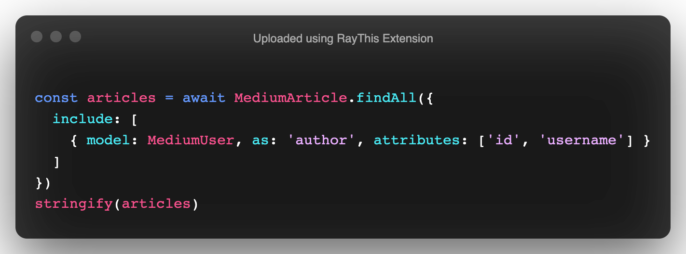
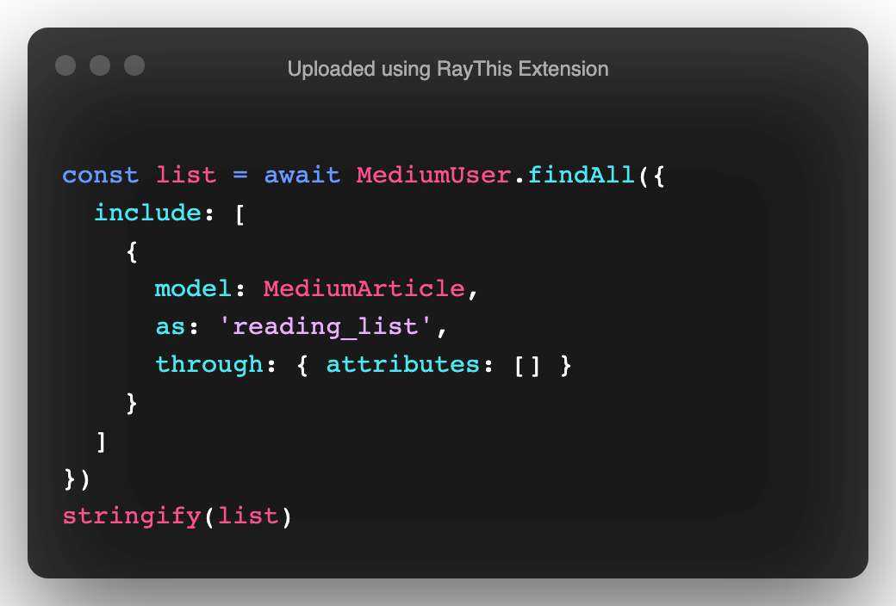
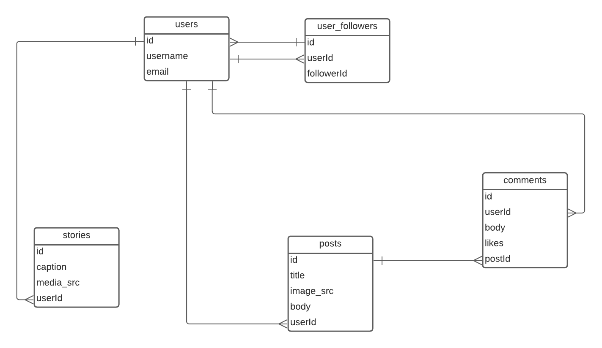
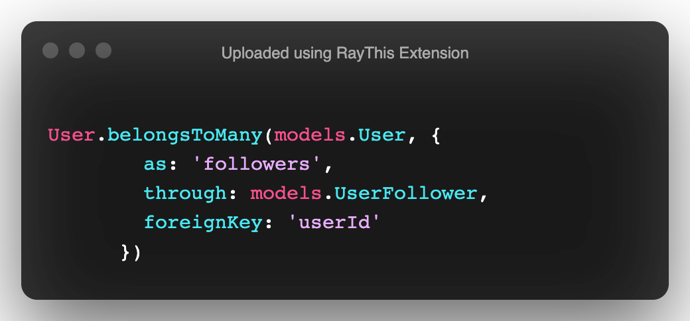
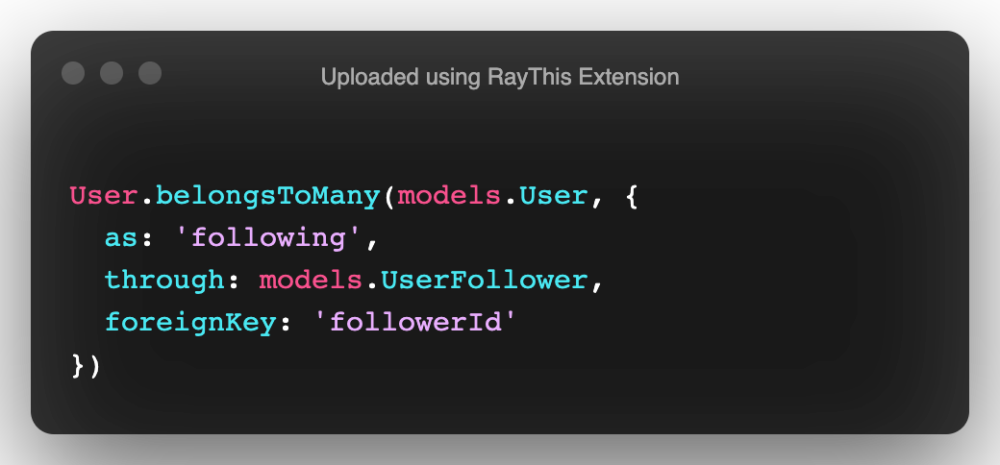

# Sequelize Complex Associations


## Overview

In this lesson, we'll be covering how to incorporate many-many relationships with Sequelize. Many-Many relationships are an important feature of relational databases that allow us to associate data to many records in our database.

## Getting Started

- Fork and Clone
- `npm run setup` => This command will set up both applications for you.

## What are Many-Many Relationships

Many-Many relationships are a representation of multiple owners for a given record. For example, many users can save the same article to their library.

Another example would be Github:

- Repos belongsToMany Users `through` Orgs

Notice the `through` keyword. By default we cannot define a many-many relationship all by itelf. We need to use a `through` or `join` table to store those references. We'll learn how to set these up in the next step.

## Medium Clone

We'll start by building a small Medium clone to help us understand how a many-many relationship is set up and implemented.

Take a look at the following ERD, can you identify the `join` table?



<details closed>
<summary>Heres a hint</summary>
<code>user_reading_list</code>
</details>

If you've made it this far, the `user_reading_list` table is the representation of our `join` table! We'll store the `userId` and the `articleId` in this table to keep a record of which user has added an article to their reading list.

In this example, multiple users have ownership of an article via the `join` table.

### Implementing The Code

Head over to the `medium_clone` folder. Let's take a look at the provided models.

You'll notice we have three:

- `MediumArticle`
- `MediumReadingList`
- `MediumUser`

Let's take a look at the `MediumReadingList` model:



You'll notice that there are two `foreign keys` declared here:

- `userId`
- `articleId`

The `userId` is a reference to the `medium_users` table.
The `articleId` is a reference to the `medium_articles` table.

However, just because we have the `foreign keys` does not mean that our relationship is set up.

To do this we'll need to update our `MediumUser` and `MediumArticle` models.

Head over to the `MediumUser` model. Here we'll declare the association.

Add the following code to the `associate` method:

```js
MediumUser.belongsToMany(models.MediumArticle, {
  as: 'reading_list',
  through: models.MediumReadingList,
  foreignKey: 'userId'
})
```

Let's break this down, we're using the `belongsToMany` method to define a `many-many` relationship betweeen the `User` and `Article`.

As options, we utilize the `as` keyword to `alias` the retrieved data.

**Note**: This is required when defining many-many relationships.

We then pass a `through` option. This option should reference your `join` table.

And finally we declare which foreign key to use to load the assoiciated data.

### Implementing The Article Association

Head over to the `MediumArticle` model, we'll define our many-many relationship here as well:

```js
MediumArticle.belongsToMany(models.MediumUser, {
  through: models.MediumReadingList,
  as: 'articles',
  foreignKey: 'articleId'
})
```

Notice here that our `alias` is different. These aliases are used to identify the incoming data.

## Querying Many-Many

Let's open `medium_clone/query.js`

You can run `node medium_clone/query.js` to view the output after each step.

### Users and Articles

We'll start by querying `users` and `articles`. This association was done for you and represents a one-many relationship for articles that a user has written.

In the `userAndArticle` function, add the following code:



This method will load all of the users' written articles.

### Article Authors

Next we'll query for a users reading list. Add the following to `getArticleAuthors`:



Here we are querying for an articles author. This again is a one-many that has been done for you.

### User Reading List

Now we'll query for a users reading list. This is the many-many relationship that we set up together. Add the following to `getReadingList`:



Let's break this down:

- We're querying for all of the users
- We include the articles utilizing our alias that we defined for our `many-many`
- The `through` option is used to hide the join tables' fields as they are unecessary. By default without the `through` option in the query, the `ReadingList` model gets returned along with the `Article` which can put unecessary strain on our database. By using the `attributes:[]`, we are telling sequelize to omit the join table fields and only load the information for the `articles`.

## You Do: Implementing a Many-Many-Self

Work in the `instagram_clone` directory.

A many-many-self relationship is represented in this ERD:



**Note**: There are other tables displayed as well that have not been built. If you finish early, try to implement the remaining tables and associations.

You'll first need to set up the association for users. The join table, `UserFollower`; has been created for you already!

In the `User` model, you'll need two `belongsToMany` relationships:

- One relationship will define who is following us
- The other will define who we are following

### Followers



We utilize the `userId` as a foreign key here because this will load the other users via `followerId`.

### Following



By utilizing the `followerId` here, we can query the data in reverse and retrieve the users that we are following. This also works for the above relationship by telling us how we are referencing the user following us.

### Querying

Work in `instagram_clone/query.js` file to retrieve the data for the users.

Follow the prompts provided in both functions.

You can see the output of your query by running `node instagram_clone/query.js`

## Recap

In this lesson, we learned how to define and query `many-many` and `many-many-self` relationships using Sequelize. By utilizing aliases, we can better organize and represent our retrieved data in a meaningful and declrative way.

We also learned how to leverage `join` tables to store multiple references and to query our associated data.

## Resources

- [Sequelize Docs](https://sequelize.org/master/manual/advanced-many-to-many.html)
- [Sequelize Many-Many](https://medium.com/@the_ozmic/how-to-create-many-to-many-relationship-using-sequelize-orm-postgres-on-express-677753a3edb5)
