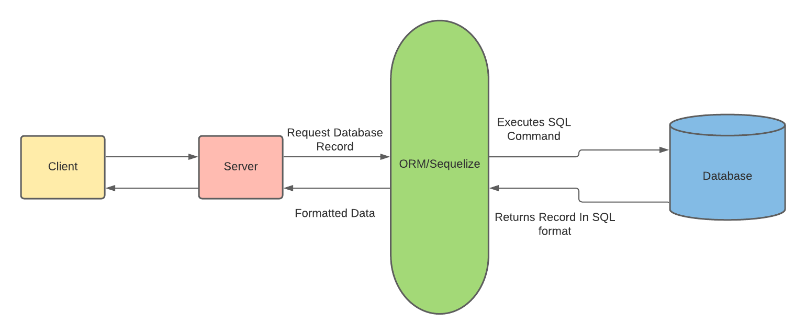

# Introduction To Sequelize


## Getting started

- Fork and Clone

## Sequelize

[Sequelize](http://sequelizejs.com) is a promise-based Node.js ORM for Postgres, MySQL, MariaDB, SQLite and Microsoft SQL Server. It features solid transaction support, relations, eager and lazy loading, read replication and more." - sequelize.org

Sequelize is a JavaScript Object Relational Mapping tool! Its an abstraction layer for raw SQL. Instead of raw SQL we can use JavaScript to interact with our database.

> Let's take five minutes and read what an ORM is:
>
> - [What is an ORM and why you should use it](https://blog.bitsrc.io/what-is-an-orm-and-why-you-should-use-it-b2b6f75f5e2a)



The `ORM` works as a middleman between our backend server and our database, it handles things such as:

- Finding the requested information
- Querying the database correctly
- Parsing the retrieved data from the database
- Returning the data in a readable format

Great, but how do we use Sequelize? Let's start by installing the [Sequelize Client](https://github.com/sequelize/cli):

Like Express and Redux, there is going to be a strict set of orders to follow to get this set up. Once we see the patterns in our actions we will understand why we are doing each step

```sh
npm init -y
npm install sequelize pg
npm install -g sequelize-cli
```

**_The last command will install the Sequelize CLI on your machine and gives us access to the `sequelize` command from anywhere in our terminal._**

---

**To view a list of all of the `sequelize` commands you can use: `sequelize --help`**

---

Next we will initialize a Sequelize project then open it in VS Code:

```sh
sequelize init
code .
```

You'll notice after executing this command, a few folders and files are generated for you:

- `config`
- `models`
- `seeders`

### Config

The `config` folder stores the necessary information for sequelize to connect to our database:

```json
{
  "development": {
    "username": "root",
    "password": null,
    "database": "database_development",
    "host": "127.0.0.1",
    "dialect": "mysql"
  },
  "test": {
    "username": "root",
    "password": null,
    "database": "database_test",
    "host": "127.0.0.1",
    "dialect": "mysql"
  },
  "production": {
    "username": "root",
    "password": null,
    "database": "database_production",
    "host": "127.0.0.1",
    "dialect": "mysql"
  }
}
```

By default the database chosen is `mysql`, let's modify this config file to utilize `postgres`. Replace the current `config.json` with the following:

```json
{
  "development": {
    "database": "sequelize_development",
    "host": "127.0.0.1",
    "dialect": "postgres"
  },
  "test": {
    "database": "sequelize_test",
    "host": "127.0.0.1",
    "dialect": "postgres"
  },
  "production": {
    "database": "sequelize_production",
    "host": "127.0.0.1",
    "dialect": "postgres"
  }
}
```

> **NOTE**: This config is modified project to project. When initializing a new project be sure to update this file first!

## Initializing a Database

Sequelize provides us with quite a few helpful commands to manage our database.

One of them being the command to create our database. Instead of us having to go into the postgres shell, we can utilize `sequelize db:create`:

Run the following command in your terminal within your project directory:

```sh
sequelize db:create
```

## Sequelize Models

Sequelize also has commands to generate models. `Models` are javascript classes that describe to `sequelize` what our database table should look like.

For example a user model could look like the following in javascript:

```js
let user = {
  firstName: String,
  lastName: String,
  email: String,
  password: String
}
```

The above object will tell sequelize to create a table with the following `SQL` statement:

```SQL
CREATE TABLE "Users" (
  firstName String,
  lastName String,
  email String,
  password String
);
```

### Generating Models

To generate models, `sequelize` has a very helpful command:

```sh
sequelize model:generate --name <ModelName> --attributes <someKey>:<datatype>,<anotherKey>:<anotherDatatype>
```

A few notes:

- The model name should always be `PascalCased`
- Attributes key should always be `camelCased`
- Multiple attributes must be seperated by a comma and **NO SPACES**

Let's create a `User` model with the following attributes:

```js
{
  firstName: string,
  lastName:string,
  email:string,
  password:string
}
```

Execute the following command:

```sh
sequelize model:generate --name User --attributes firstName:string,lastName:string,email:string,password:string
```

The above command will create `two` files:

- a model file in the `models` folder.
- a migration file in the `migrations` folder.

Let's start by seeing what our `User` model looks like:

`sequelize/models/user.js`:

```js
'use strict'
const { Model } = require('sequelize')
module.exports = (sequelize, DataTypes) => {
  class User extends Model {
    /**
     * Helper method for defining associations.
     * This method is not a part of Sequelize lifecycle.
     * The `models/index` file will call this method automatically.
     */
    static associate(models) {
      // define association here
    }
  }
  User.init(
    {
      firstName: DataTypes.STRING,
      lastName: DataTypes.STRING,
      email: DataTypes.STRING,
      password: DataTypes.STRING
    },
    {
      sequelize,
      modelName: 'User'
    }
  )
  return User
}
```

Next we'll take a look at the corresponding `migration` file:

`sequelize/migrations/<some timestamp>-create-user.js`:

```js
'use strict'
module.exports = {
  up: (queryInterface, Sequelize) => {
    return queryInterface.createTable('Users', {
      id: {
        allowNull: false,
        autoIncrement: true,
        primaryKey: true,
        type: Sequelize.INTEGER
      },
      firstName: {
        type: Sequelize.STRING
      },
      lastName: {
        type: Sequelize.STRING
      },
      email: {
        type: Sequelize.STRING
      },
      password: {
        type: Sequelize.STRING
      },
      createdAt: {
        allowNull: false,
        type: Sequelize.DATE
      },
      updatedAt: {
        allowNull: false,
        type: Sequelize.DATE
      }
    })
  },
  down: (queryInterface, Sequelize) => {
    return queryInterface.dropTable('Users')
  }
}
```

The above migration will execute the following `SQL`:

```SQL
CREATE TABLE "Users" (
  firstName String,
  lastName String,
  email String,
  password String
);
```

There's one problem here, if we remember some rules from our `sql` lessons, table names should be `snake_cased`. The above `sql` will create a `PascalCased` table name which can cause weird issues if you want to interact with your database with raw `sql` queries. Such as:

```sql
SELECT * FROM "Users";
```

Notice how we have to wrap our table name in quotes. Luckily it's a simple fix. We'll start by updating our model:

```js
'use strict'
const { Model } = require('sequelize')
module.exports = (sequelize, DataTypes) => {
  class User extends Model {
    /**
     * Helper method for defining associations.
     * This method is not a part of Sequelize lifecycle.
     * The `models/index` file will call this method automatically.
     */
    static associate(models) {
      // define association here
    }
  }
  User.init(
    {
      firstName: DataTypes.STRING,
      lastName: DataTypes.STRING,
      email: DataTypes.STRING,
      password: DataTypes.STRING
    },
    {
      sequelize,
      modelName: 'User',
      tableName: 'users'
    }
  )
  return User
}
```

Here we added a `tableName` key to the second object passed to `User.init()`. The `tableName` tells sequelize when we execute a query on our model, what table it should reference.

Next we need to update our migration file to ensure the correct `sql` get's executed. Update your `user` migration file to match the following:

```js
'use strict'
module.exports = {
  up: async (queryInterface, Sequelize) => {
    await queryInterface.createTable('users', {
      id: {
        allowNull: false,
        autoIncrement: true,
        primaryKey: true,
        type: Sequelize.INTEGER
      },
      firstName: {
        type: Sequelize.STRING
      },
      lastName: {
        type: Sequelize.STRING
      },
      email: {
        type: Sequelize.STRING
      },
      password: {
        type: Sequelize.STRING
      },
      createdAt: {
        allowNull: false,
        type: Sequelize.DATE
      },
      updatedAt: {
        allowNull: false,
        type: Sequelize.DATE
      }
    })
  },
  down: async (queryInterface, Sequelize) => {
    await queryInterface.dropTable('users')
  }
}
```

The first argument to the `createTable` method is the name of the table, by default, `Sequelize` makes this `PascalCased`, we'll update this argument with the proper casing for tables which is `snake_cased`.

## Migrations

Migrations are `tracked` changes to our database. They keep a record of what changes we performed on our database and when. Why is this important? Utilizing migrations, we can make changes to our database without deleting everything from the table that we create. It also provides a written record for other developers/engineers to see what changes we made to a database over a given time.

### Executing Migrations

Now that our migration is created, it's no good without actually executing it. Sequelize provides us with a command for this. Execute the following command in your terminal:

```sh
sequelize db:migrate
```

> If you made a mistake, you can always rollback: `sequelize db:migrate:undo`

## Generating Seeds

Seeds are some type of fake data that we create that allows us to test database features while being in a development environment and not making changes to our production data.

Let's create a seed file:

```sh
sequelize seed:generate --name user
```

Let's edit the file `sequelize/seeders/<some timestamp>-user.js`:

```js
module.exports = {
  up: (queryInterface, Sequelize) => {
    return queryInterface.bulkInsert(
      'users',
      [
        {
          firstName: 'John',
          lastName: 'Doe',
          email: 'demo@demo.com',
          password: '$321!pass!123$',
          createdAt: new Date(),
          updatedAt: new Date()
        }
      ],
      {}
    )
  },

  down: (queryInterface, Sequelize) => {
    return queryInterface.bulkDelete('users', null, {})
  }
}
```

Execute the seed file:

```sh
sequelize-cli db:seed:all
```

> Made a mistake? You can always undo: `sequelize db:seed:undo`

## Viewing Our Database

Now that we've successfully created a database, generated a table and inserted some data, we can view what the data look's like in the postgres shell.

Drop into psql and connect to the database:

```sh
psql sequelize_development
```

View the generated tables:

```sh
\dt
```

You'll notice two tables:

```sh
+----------+---------------+--------+-----------+
| Schema   | Name          | Type   | Owner     |
|----------+---------------+--------+-----------|
| public   | SequelizeMeta | table  | andrepato |
| public   | users         | table  | andrepato |
+----------+---------------+--------+-----------+
```

We have a `users` table and a `SequelizeMeta` table.

Let's see what's in the `SequelizeMeta` table:

```sh
SELECT * FROM "SequelizeMeta";
```

```sh
+-------------------------------+
| name                          |
|-------------------------------|
| 20210228182640-create-user.js |
+-------------------------------+
```

This table keeps track of the `migration` files that were executed to make the changes to the database.

Next let's query our `users` table:

```sh
SELECT * FROM users;
```

```sh
+------+-------------+------------+---------------+----------------+----------------------------+----------------------------+
| id   | firstName   | lastName   | email         | password       | createdAt                  | updatedAt                  |
|------+-------------+------------+---------------+----------------+----------------------------+----------------------------|
| 1    | John        | Doe        | demo@demo.com | $321!pass!123$ | 2021-02-28 13:45:07.665-05 | 2021-02-28 13:45:07.665-05 |
+------+-------------+------------+---------------+----------------+----------------------------+----------------------------+
```

You should see a table with the seeded user. To exit the table press `q` and to exit `psql` type `\q`.

## Recap

In this lesson, we learned the very basics of using the `Sequelize` orm to generate models and migrations. Keep in mind that just because we are working with javascript, does not mean that the conventions and rules from other languages don't apply as well. Remember **`table names`** should always be `snake_cased`. When working with `Sequelize`, theres an order of operations that we follow:

- Install the `sequelize` and `pg` modules in our project.
  - `npm install sequelize pg`
- Use `sequelize init` to generate the files and folders.
- Update the `config` file for our project.
- Use `sequelize model:generate` to create our model.
- Update the model config for properly cased tables
  - ```js
    Model.init({ fields }, { tablename: 'some_snake_cased_name' })
    ```
- Update the migration file with the correct table name:

  - ```js
    module.exports = {
      up: await queryInterface.createTable('some_snake_cased_name', { fields }),
      down: async (queryInterface, Sequelize) => {
        await queryInterface.dropTable('some_snake_cased_name')
      }
    }
    ```

- Execute the `migration`
  - `sequelize db:migrate`

## Resources

- [Sequelize Docs](https://sequelize.org/master/index.html)
- [Sequelize Migrations](https://sequelize.org/master/manual/migrations.html)
