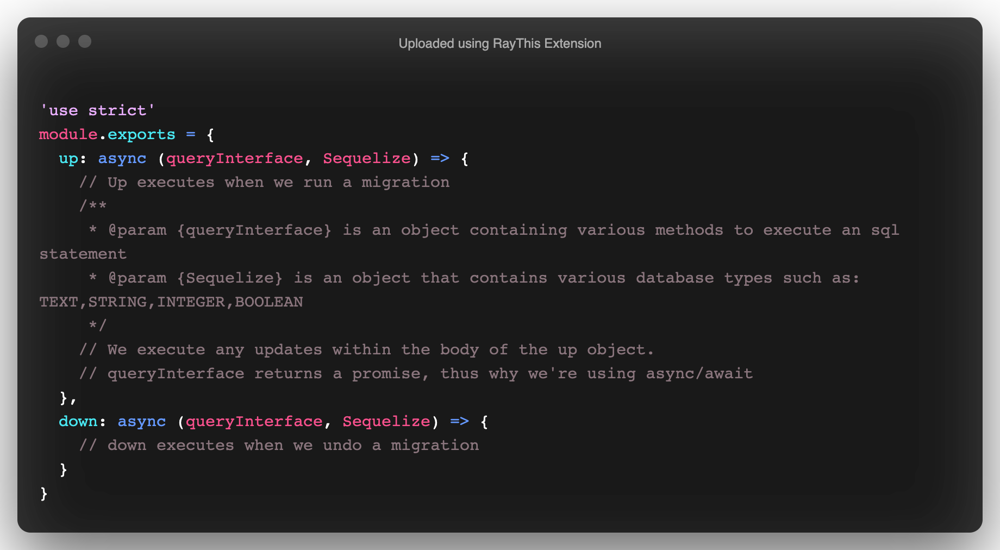

# Sequelize Migrations


## Overview

In this lesson, we'll learn how migrations are useful for tracking changes made to our database. When you build applications, keep in mind that other developers need to understand our code. Migrations help us by keeping track of every change we performed to our database so that we can maintain data integrity and easy onboarding for other contributors.

## Objectives

- Learn how migrations work
- Learn how migrations effect currently stored data
- Learn when to use migrations

## Getting Started

- Fork and Clone
- `npm install`
- `sequelize db:create`
- `sequelize db:migrate`

## What Are Migrations

_Take five minutes and read the Sequelize docs on migrations: [Sequelize Migrations](https://sequelize.org/master/manual/migrations.html)_

Migrations are an important feature to have while managing a database. They allow us to add, remove or change columns or tables without destroying our stored information. Database integrity is key when you're building applications ready for public use. Every time you make an update to your database you should not lose any stored information. Like our Git Add / Commit / Push process, Migrating in Sequelize will require a few steps to get set up before we can run it

## Final Schema

Once we finish this lesson, our `User` schema/model should resemble the following:


Constraints:

- email
  - string `not null`

## Understanding An Existing Codebase

You have been provided with a Sequelize project to start with. As with any codebase that you'll open for the first time, it's always a great idea to take a look at the included files and folders. Let's start by taking a look at the provided `User` model:

`models/user.js`

```js
'use strict'
const { Model } = require('sequelize')
module.exports = (sequelize, DataTypes) => {
  class User extends Model {
    /**
     * Helper method for defining associations.
     * This method is not a part of Sequelize lifecycle.
     * The `models/index` file will call this method automatically.
     */
    static associate(models) {
      // define association here
    }
  }
  User.init(
    {
      firstName: DataTypes.STRING,
      lastName: DataTypes.STRING,
      email: DataTypes.STRING,
      password: DataTypes.STRING
    },
    {
      sequelize,
      modelName: 'User',
      tableName: 'users'
    }
  )
  return User
}
```

You'll notice that there's a missing field in the model, `username`. It looks like someone made a mistake when creating our `User` model.

## Using Migrations As Records

Let's take a look at the provided migration and see what happened when generating our table.

`migrations/20201127061156-create-user.js`

```js
'use strict'
module.exports = {
  up: async (queryInterface, Sequelize) => {
    await queryInterface.createTable('users', {
      id: {
        allowNull: false,
        autoIncrement: true,
        primaryKey: true,
        type: Sequelize.INTEGER
      },
      firstName: {
        type: Sequelize.STRING
      },
      lastName: {
        type: Sequelize.STRING
      },
      email: {
        type: Sequelize.STRING
      },
      password: {
        type: Sequelize.STRING
      },
      createdAt: {
        allowNull: false,
        type: Sequelize.DATE
      },
      updatedAt: {
        allowNull: false,
        type: Sequelize.DATE
      }
    })
  },
  down: async (queryInterface, Sequelize) => {
    await queryInterface.dropTable('users')
  }
}
```

Looking at the above migration, you'll notice that a `userName` field was never provided. It appears someone made a mistake...

Luckily it's a simple fix! We can use `Sequelize` to create a new migration to make this change. Run the following command in your terminal:

```sh
sequelize migration:generate --name add-username-to-users
```

> Want to know more about generating migrations using the Sequelize CLI? Run `sequelize migration:generate --help`

### Breaking Down The Migration File

Once you've run the prior command, a new migration file is created for you.

We could have just run `sequelize db:migrate:undo` to fix the issue, but you would run into another problem. All of the users would have been deleted from our database. In a case like this, generating a migration is always a better idea!

Let's break down how a migration works:



### Executing Statements

`Sequelize` provides us with some really cool methods to make updates to our database and tables. You may be familiar with one already:


With most of the provided methods, the first argument will always be the `target table`. The second or third arguments can be a column or fields/options.

In the case of `createTable`, we pass in the desired table to create and the fields we want to add to the table.

In order to fix our `users` table, we'll be utilizing a method called `addColumn` on the `up` transaction and `removeColumn` on the `down` transaction.

Let's update our new migration with the following:

```js
module.exports = {
  up: (queryInterface, Sequelize) => {
    return queryInterface.addColumn('users','userName',{
      type:Sequelize.STRING
      }
    );
  },
  down: (queryInterface, Sequelize) => {
    return queryInterface.removeColumn('users', 'userName');
  }
};
```

Let's see how the above works:


We'll link the full list of methods in the **[Resources](#resources)** section!

Next, we need to reflect the pending change in our desired model. Update your `User` model with a `userName` field:

```js
'use strict'
const { Model } = require('sequelize')
module.exports = (sequelize, DataTypes) => {
  class User extends Model {
    /**
     * Helper method for defining associations.
     * This method is not a part of Sequelize lifecycle.
     * The `models/index` file will call this method automatically.
     */
    static associate(models) {
      // define association here
    }
  }
  User.init(
    {
      firstName: DataTypes.STRING,
      lastName: DataTypes.STRING,
      email: DataTypes.STRING,
      password: DataTypes.STRING,
      userName: Datatypes.STRING
    },
    {
      sequelize,
      modelName: 'User',
      tableName: 'users'
    }
  )
  return User
}
```

Now we're ready to run the migration:

```sh
sequelize db:migrate
```

> If you made a mistake, you can always rollback: sequelize db:migrate:undo

Let's make sure the column was added:

```sh
psql sequelize_migrations_development
SELECT * FROM users;
```

### Impending Doom

Take a second to look at our `User` model and the provided `Table` in the [Final Schema](#Final-Schema) section. You'll notice that the field is supposed to be `username` and we called it `userName`. Whoops....

Let's fix this issue. Start by generating another migration file:

```sh
sequelize migration:generate --name rename-userName-to-username
```

Update the migration file with the following code:

```js
module.exports = {
  up: (queryInterface, Sequelize) => {
    return queryInterface.renameColumn('users', 'userName', 'username')
  },
  down: (queryInterface, Sequelize) => {
    return queryInterface.renameColumn('users', 'username', 'userName')
  }
}
```

Here's a breakdown:


Let's run this migration:

```sh
sequelize db:migrate
```

Next we need to reflect these changes in our model. Update your `User` model with the following:

```js
'use strict'
const { Model } = require('sequelize')
module.exports = (sequelize, DataTypes) => {
  class User extends Model {
    /**
     * Helper method for defining associations.
     * This method is not a part of Sequelize lifecycle.
     * The `models/index` file will call this method automatically.
     */
    static associate(models) {
      // define association here
    }
  }
  User.init(
    {
      firstName: DataTypes.STRING,
      lastName: DataTypes.STRING,
      email: DataTypes.STRING,
      password: DataTypes.STRING,
      username: Datatypes.STRING
    },
    {
      sequelize,
      modelName: 'User',
      tableName: 'users'
    }
  )
  return User
}
```

Make sure the change was applied:

```sh
psql sequelize_migrations_development
SELECT * FROM users;
```

## One Final Change

If you notice the contraints section below the [Final Schema](#Final-Schema) section, emails should always be required. In techinal terms, `not null`.

So now you have one last change you'd like to make to your database. You want to have `email` be required (no nulls). That means we need to create a migration to change our already existing `email` column to not allow nulls. Let's create a new migration to fix this issue:

```sh
sequelize migration:generate --name add-null-contraint-user-email
```

We'll utilize the `changeColumn` method to make this change:

```js
module.exports = {
  up: (queryInterface, Sequelize) => {
    return queryInterface.changeColumn('users', 'email', {
      type: Sequelize.STRING,
      allowNull: false
    })
  },
  down: (queryInterface, Sequelize) => {
    return queryInterface.changeColumn('users', 'email', {
      type: Sequelize.STRING,
      allowNull: true
    })
  }
}
```

Now we're ready to apply the changes:

```sh
sequelize db:migrate
```

We now have to reflect this change in our `User` model:

```js
'use strict'
const { Model } = require('sequelize')
module.exports = (sequelize, DataTypes) => {
  class User extends Model {
    /**
     * Helper method for defining associations.
     * This method is not a part of Sequelize lifecycle.
     * The `models/index` file will call this method automatically.
     */
    static associate(models) {
      // define association here
    }
  }
  User.init(
    {
      firstName: DataTypes.STRING,
      lastName: DataTypes.STRING,
      email: {
        type: DataTypes.STRING,
        allowNull: false
      },
      password: DataTypes.STRING,
      username: Datatypes.STRING
    },
    {
      sequelize,
      modelName: 'User',
      tableName: 'users'
    }
  )
  return User
}
```

Test it out:

```sql
psql sequelize_migrations_development
INSERT INTO users VALUES (2, 'Jane', 'Dee');
```

The result should be `null value in column "email" violates not-null constraint`.

> Want to successfully `INSERT`? Try `INSERT INTO users VALUES (Default, 'Jane', 'Dee', 'jane@dee.com', 'STRONG', now(), now(), 'janeD');`

## Recap

In this lesson, we learned how to use migrations to fix mistakes or update our tables without destroying data. Migrations are a written record of every change you've ever made to your database. They allow you and other developers to easily pick up a foreign codebase and understand how the database was designed in a short amount of time.

## Resources

- [Sequelize Migrations](https://sequelize.org/master/manual/migrations.html)
- [Sequelize QueryInterface](https://sequelize.org/api/v6/class/src/dialects/abstract/query-interface.js~queryinterface)
