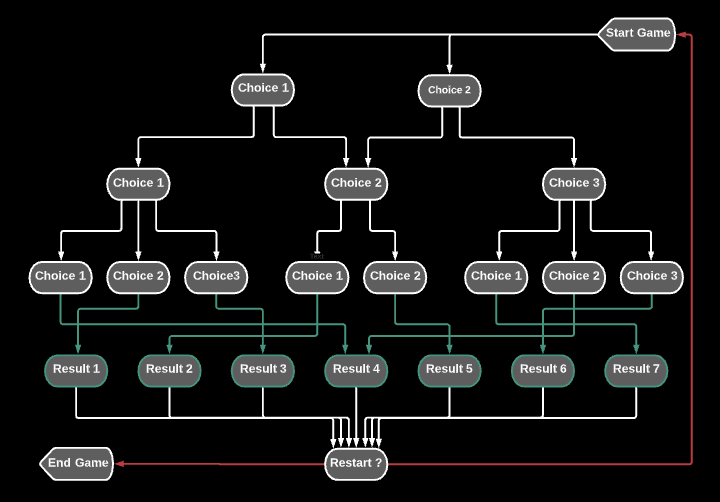

# Build Your Own Adventure (Python)

## Overview
In this deliverable, we'll be building our own adventure to practice with control flow in Python.

## Getting Started

- `fork` and `clone` this repository

## What You'll Be Building
Here is a diagram of how you might build your control flow adventure

## Deliverables

Build your own CLI adventure.

Test your file by `python3 main.py`.

Using if/elif/else, create an adventure game that a user can play. You should be able to accept a user input from the terminal and a user should be able to choose different paths. Be creative and have fun with it!

## Helpful Hints

- `input()` is a useful python method that accepts terminal input.
- `int()` is useful to convert an input to an integer.
- `str()` is useful to convert an input to a string.

___
## Requirements
- Must have a minimum of 4 paths a user can take in the game and 7 or more end scenarios.
- Must have a play again option

## Submission Guidelines
Submit a pull request utilizing the [PR Template](https://github.com/SEI-R-7-26/template_pull_request)
